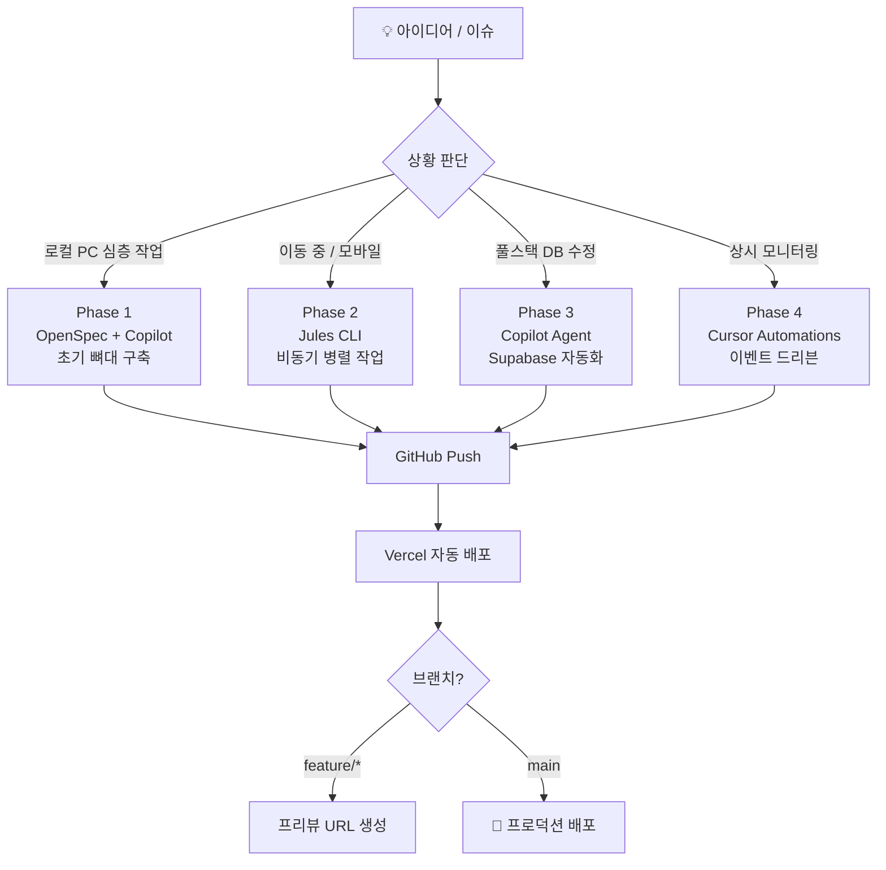
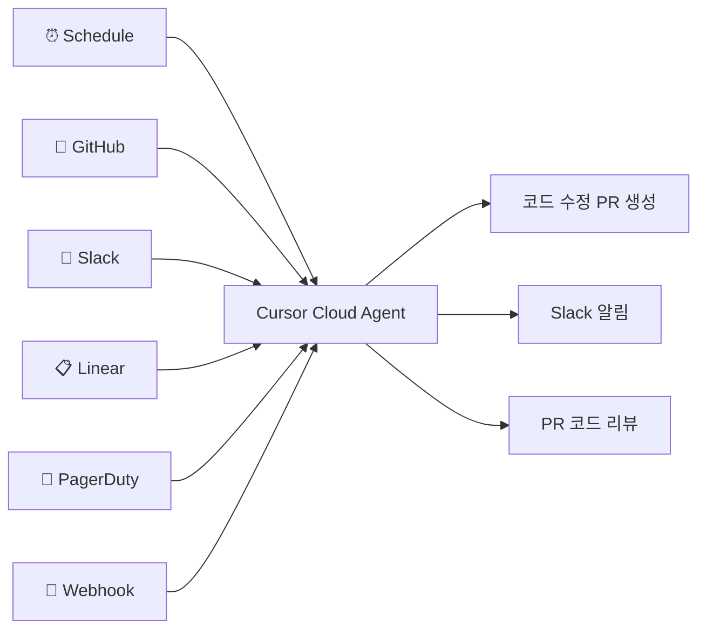

# 🚀 프론트엔드 개발자의 한계를 부수는 AI 에이전트 주도 풀스택 워크플로우

> **"타자 속도가 아니라, 에이전트가 쉬지 않고 일할 수 있도록 시스템을 설계하는 오케스트레이션 능력이 1인 개발자의 경쟁력이다."**

---

## 🧐 들어가며 — 당신은 이런 상황에 있지 않나요?

- 🏢 **회사에서**: React 컴포넌트를 만들고, 백엔드 API는 "그쪽 팀에 요청"합니다.
- 🤔 **DB 변경?**: RLS 정책 설정? "잘 모르겠는데..."라며 뒤로 물러섭니다.
- 🚧 **사이드 프로젝트**: 풀스택의 벽 앞에서 번번이 멈춥니다.

**이 글은 그 벽을 부수는 이야기입니다.**

---

## 🎮 독박게임 (Dokbak Game)

지인들과 함께 즐기려고 만든 개인 웹게임 프로젝트.
프론트엔드 개발자 혼자서 **Next.js + Supabase** 풀스택을 운영 중인 실제 사이드 프로젝트입니다.

👉 **[dokbakgame.vercel.app](https://dokbakgame.vercel.app)**

이 프로젝트를 어떻게 AI 에이전트들과 함께 만들고 운영해 왔는지,
그리고 2026년 3월 현재 어디까지 진화했는지 **4단계**로 나눠 공유합니다.

---

## 🗺️ 전체 워크플로우 개요



---

## 🏗️ Phase 1 — 로컬 뼈대 구축

> **"먼저 구조를 선언하고, AI가 그 구조를 채운다."**

### 1️⃣ OpenSpec으로 아키텍처를 먼저 설계하다

막연하게 코드를 짜기 전에, **OpenSpec**으로 프로젝트의 요구사항과 아키텍처를 선언적으로 정의했습니다.
`openspec/project.md`에 기술 스택, 컨벤션, 도메인 컨텍스트를 기록해두면 이후 모든 AI 에이전트가 이 문서를 참조해 일관된 코드를 생성합니다.

---

### 💻 OpenSpec 실행 예시

```bash
# OpenSpec 초기화
npx openspec init

# 변경 제안서 생성 (예: 게임 점수 저장 기능 추가)
# openspec/changes/add-game-score/ 하위에 proposal.md, tasks.md, spec 델타 생성
openspec validate add-game-score --strict
```

---

### 📝 `openspec/project.md`의 핵심 역할

```markdown
## Domain Context
- 독박게임: Next.js App Router + Supabase PostgreSQL 기반 웹게임
- 인증: Supabase Auth (Google OAuth)
- DB: game_scores, users, game_sessions 테이블
- 배포: Vercel (main → 프로덕션, feature/* → 프리뷰)
```

---

### 🤖 GitHub Copilot으로 보일러플레이트를 빠르게

OpenSpec이 **"무엇을 만들지"** 를 정의했다면, GitHub Copilot이 **"어떻게 만들지"** 를 실행합니다.

```bash
# Next.js 프로젝트 초기화
npx create-next-app@latest dokbak-game \
  --typescript --tailwind --eslint --app --src-dir

# Supabase 클라이언트 설치
npm install @supabase/supabase-js @supabase/ssr
```

---

### 💬 VS Code Copilot Chat 예시

```text
@workspace openspec/project.md를 참고해서
/src/lib/supabase/client.ts 와 server.ts를 생성해줘
```

---

### 🚀 Vercel CLI로 CI/CD 파이프라인 연결

```bash
# Vercel CLI 설치 및 프로젝트 연결
npm install -g vercel
vercel link

# 로컬에서 프로덕션 환경 변수 확인
vercel env pull .env.local

# 배포 테스트 (프리뷰)
vercel deploy
```

---

### 🌐 Vercel 배포 환경

GitHub 저장소와 Vercel을 연결하면 이후 모든 push는 자동으로 빌드됩니다:

| 브랜치 | 배포 환경 | URL |
|--------|-----------|-----|
| `main` | Production | `dokbakgame.vercel.app` |
| `feature/*` | Preview | `dokbakgame-git-feature-xxx.vercel.app` |
| `develop` | Preview | `dokbakgame-git-develop.vercel.app` |

💡 **Key Takeaway**: OpenSpec으로 아키텍처를 선언하면 이후 투입되는 모든 AI 에이전트가 프로젝트 컨텍스트를 공유한다.

---

## 📱 Phase 2 — 공간의 제약 해소

> **"퇴근 후 버스 안에서도 PR이 쌓인다."**

### 🧠 Jules란 무엇인가

**Jules**는 Google이 만든 클라우드 기반 비동기 AI 코딩 에이전트입니다.
당신이 잠을 자는 동안, 이동하는 동안, 회의하는 동안에도 Jules는 GitHub 저장소에서 코드를 분석하고 수정하며 PR을 올립니다.

---

### 🔄 Jules 워크플로우

```text
[당신의 지시 — 자연어]
        ↓
[Jules: 클라우드 VM에서 저장소 클론]
        ↓
[코드 분석 → 계획 수립 → 코드 작성]
        ↓
[테스트 실행 → Critic Agent 자체 검토]
        ↓
[GitHub PR 생성 → 알림 수신]
        ↓
[당신: 모바일로 리뷰 → Merge]
```

---

### 📈 Jules 모델 진화 타임라인

| 시기 | 모델 | 주요 변화 |
|------|------|-----------|
| 2025년 8월 | Gemini 2.5 Pro | Thinking 기반 계획 수립, 초기 Critic Agent |
| 2025년 11월 | **Gemini 3 Pro** | 멀티모달 시각 검증 강화 |
| 2026년 1월 | **Gemini 3 Flash** | 전체 적용, 속도·정확도 대폭 향상 |

> Gemini 3 Flash는 공식 발표에서 _"이전 모델보다 빠르고 훨씬 더 유능하다"_ 고 설명합니다. 코드베이스 전체를 한 번에 파악할 수 있는 이유입니다.

---

### ⚙️ Jules Continuous AI

단순 어시스턴트를 넘어, **"Continuous AI"** 패러다임을 도입했습니다:

- 🕒 **Scheduled Tasks**: 매주 월요일 의존성 취약점 검사
- 💡 **Suggested Tasks**: `// TODO` 코드를 감지해 자동 제안
- 🛠️ **CI Fixer**: 빌드 에러를 스스로 고치고 재제출
- 🔌 **MCP 연동**: DB 스키마 변경을 Jules가 직접 실행 (Supabase 등)

---

### 💻 Jules CLI — 터미널에서 제어하기

```bash
# 새 작업 위임 (현재 디렉토리에서 저장소 자동 감지)
jules remote new --session "랭킹 페이지에 태그 필터 기능 추가. \
  /app/ranking/page.tsx 참고해서 Tailwind + TypeScript 사용"

# 병렬 작업 — 같은 태스크를 5개 버전으로 동시 시도
jules remote new --session "점수 계산 로직 최적화" --parallel 3
```

**인터랙티브 대시보드 실행**: `jules`

---

### 🚇 실제 모바일 작업 시나리오

```text
[출근길 지하철] 모바일로 접속
↓
"랭킹 페이지 1~10위 배경색 변경. /app/ranking/page.tsx 수정"
↓
[Jules가 클라우드에서 작업 시작]
↓
[점심시간] 푸시 알림: "PR #47 생성됨"
↓
모바일 GitHub 앱에서 diff 확인 → Merge
↓
Vercel 자동 배포 완료 🚀
```

💡 **Key Takeaway**: 이동 중에도 작업을 위임하고, 리뷰하는 **비동기 개발 루프**가 생산성을 높인다.

---

## 🔧 Phase 3 — 풀스택 시연

> **"프론트엔드 개발자가 DB 마이그레이션을 두려워하지 않게 되는 순간."**

### 🎯 시연: "게임 결과 저장" 기능 추가

VS Code에서 GitHub Copilot Agent에 단 한 번의 지시:

```text
@workspace openspec/project.md와
openspec/changes/add-game-score/proposal.md를 참고해서
게임 결과 저장 기능을 구현해줘.
1. 프론트엔드 컴포넌트
2. Supabase SQL 마이그레이션 파일
3. RLS 정책
4. API Route
```

---

### ✨ Copilot Agent 결과물 요약

1. **React 컴포넌트 (`GameResult.tsx`)**: 점수 저장 버튼과 알림 처리
2. **SQL 마이그레이션 (`create_game_scores.sql`)**: 테이블 생성 및 **RLS 정책(보안)** 설정
3. **API 라우트 (`route.ts`)**: 인증된 사용자의 데이터만 처리하도록 백엔드 로직 구성

> 이 모든 걸 한 번의 프롬프트로 생성!

---

### 🚀 DB 마이그레이션 적용

```bash
# 로컬 Supabase 환경에 마이그레이션 적용
npx supabase db push

# 프로덕션에 직접 적용
npx supabase db push --linked
```

---

### 🤯 이게 왜 혁명적인가

예전 같으면 이 작업은 **최소 3명**이 필요했습니다:
1. 백엔드 개발자 (테이블 설계 + RLS 정책)
2. DBA (인덱스 최적화)
3. 프론트엔드 개발자 (컴포넌트 + API 호출)

💡 **Key Takeaway**: 프론트엔드 개발자가 DB를 두려워하지 않게 만드는 것은 "공부"가 아니라 **"좋은 컨텍스트 설계"**다.

---

## ⚡ Phase 4 — 넥스트 레벨

> **"반응하는 AI에서, 먼저 움직이는 AI로."**

### 🤖 Cursor Automations (2026년 3월)

| 구분 | Jules | Cursor Automations |
|------|-------|-------------------|
| **작동 방식** | 명령형 (내가 지시해야 시작) | 이벤트 드리븐 (트리거 발생 시 자동) |
| **실행 환경** | Google Cloud VM | Cursor Cloud Sandbox |
| **항상 켜져 있나?** | ❌ 세션 단위 | ✅ 상시 가동 |
| **적합한 작업** | 기능 추가, 리팩토링 | 코드 리뷰, 모니터링, 버그 수정 |

---

### 🔗 Cursor Automations 트리거



---

### 🎬 활용 시나리오

1. **Vercel 빌드 에러 자동 수정**: 빌드 실패 시 Webhook 트리거 → 에러 분석 → 핫픽스 PR 생성.
2. **PR 자동 보안 리뷰**: GitHub PR 생성 시 트리거 → diff 분석 → RLS 누락 등 코멘트.
3. **자동 테스트 커버리지**: 매일 새벽 Cron 트리거 → 테스트 없는 함수 탐지 → 테스트 작성 PR.

---

## 🎯 마무리 — 에이전트 오케스트레이션 시대

### 🛠️ 도구 매트릭스

| 상황 | 도구 | 나의 역할 |
|------|------|-----------|
| 로컬 초기 설계 | **OpenSpec** | 아키텍처 설계자 |
| 로컬 코드 작성 | **Copilot Agent** | 리뷰어 |
| 모바일 비동기 | **Jules CLI** | 작업 위임자 |
| 풀스택 DB | **Copilot + Supabase** | 검토자 |
| 상시 자동화 | **Cursor Automations** | 시스템 설계자 |
| CI/CD 배포 | **Vercel** | (완전 자동) |

---

### 💡 1인 개발자의 새로운 정의

- **과거**: 코드를 직접 타이핑하는 사람
- **현재**: AI 에이전트에게 올바른 지시를 내리는 사람
- **미래**: 에이전트들이 24시간 돌아가는 시스템을 설계하는 사람

> **"미래의 1인 개발은 타자 속도가 아니라, 에이전트가 쉬지 않고 일할 수 있도록 파이프라인을 설계하는 오케스트레이션 능력에 달려 있다."**

---

## 📎 참고 링크

- **독박게임 (데모)**: [dokbakgame.vercel.app](https://dokbakgame.vercel.app)
- **OpenSpec**: [github.com/openspec](https://github.com/openspec)
- **Jules 가이드**: [jules.google/docs](https://jules.google/docs)
- **Cursor Automations**: [cursor.com/docs](https://cursor.com/docs/cloud-agent/automations)
- **Vercel**: [vercel.com/docs](https://vercel.com/docs)
- **Supabase**: [supabase.com/docs](https://supabase.com/docs)

✨ **감사합니다!** ✨
