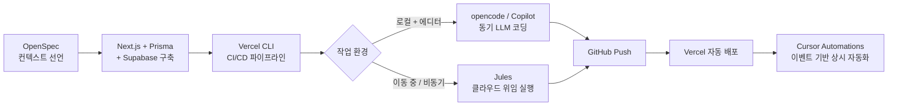
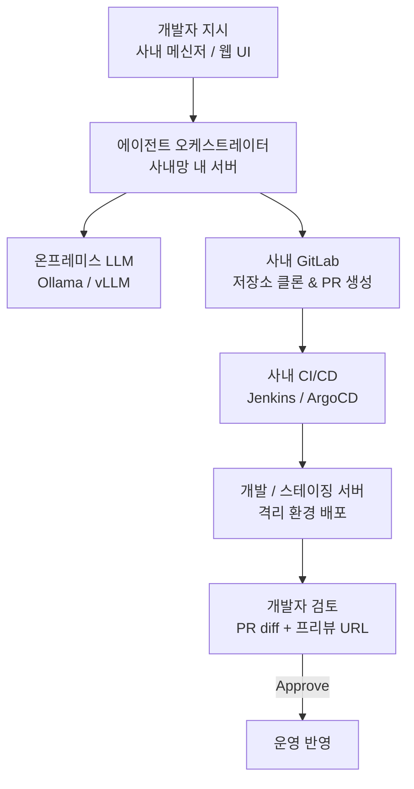
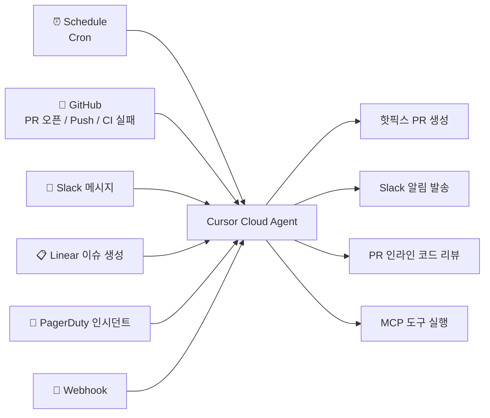

# 🚀 AI 에이전트 기반 풀스택 개발 워크플로우

> **외부에서 AI를 활용한 개인 코딩 방식을 공유하고,**  
> **사내 개발팀에 적용 가능한 구조적 인사이트를 함께 제안합니다.**

---

## 🧐 배경 — 이 워크플로우가 생긴 이유

업무에서는 프론트엔드만 담당하지만, 개인 프로젝트에서는 DB 설계부터 배포까지 혼자 처리해야 합니다.

세 가지 병목이 있었습니다:

| 병목 | 내용 |
|------|------|
| **풀스택 지식 격차** | 백엔드 / DB / 인프라는 "공부"가 아닌 "실전"에서 막힘 |
| **AI 비용** | Claude Opus / GPT Codex 계열은 토큰 소비가 빨라 장시간 사용 부담 |
| **개발 시간** | 퇴근 후, 이동 중에는 노트북을 켤 수 없는 상황이 많음 |

**이 발표는 그 세 가지 병목을 각각 어떤 도구로 해결했는지, 구조적으로 설명합니다.**

---

## 🗺️ 전체 워크플로우 구조



> 각 도구는 **독립적으로 사용 가능하지만**, 연결할수록 자동화 범위가 넓어집니다.

---

## 🏗️ Step 1 — OpenSpec: AI 에이전트용 컨텍스트 설계

### 왜 필요한가?

LLM은 맥락 없이 좋은 코드를 생성할 수 없습니다.  
Cursor, Jules, opencode 등 서로 다른 AI 에이전트가 같은 프로젝트에 투입될 때,  
**공통 사전 지식(project.md)을 미리 선언해두면 매번 설명을 반복할 필요가 없습니다.**

### 핵심 개념

- `openspec/project.md` — 스택, 컨벤션, 도메인 용어를 기술
- `openspec/changes/[id]/proposal.md` — 기능 단위 변경 제안서
- `openspec/changes/[id]/specs/[capability]/spec.md` — SHALL/MUST 기반 요구 명세

```bash
npx openspec init
openspec validate add-user-score --strict   # 요구 명세 검증
```

---

### 📝 project.md 작성 예시

```markdown
## Tech Stack
- Framework: Next.js 16 (App Router, Server Components 우선)
- Runtime: React 19
- ORM: Prisma 7 (migration 파일로 변경 이력 관리)
- DB Driver: @prisma/adapter-pg (pg 직접 연결)
- Database: Supabase (PostgreSQL + RLS)
- Auth: next-auth v5 beta (@auth/prisma-adapter)
- Deploy: Vercel (main → production, feature/* → preview)

## Conventions
- 컴포넌트: src/components/  
- API Route: app/api/ (Route Handlers)
- 환경 변수: vercel env pull로 .env.local 자동 동기화
```

> 💡 **설계 원칙**: AI 에이전트는 "좋은 프롬프트"가 아닌 **"좋은 컨텍스트"** 에 반응합니다.  
> `project.md`는 모든 AI 에이전트의 온보딩 문서 역할을 합니다.

---

### 💡 Tip — project.md를 영문 압축형으로 작성하는 이유

`project.md`는 **매 요청마다 컨텍스트 윈도우에 포함**됩니다.  
한국어 + 설명체로 작성하면 토큰 소비가 크고, LLM이 해석하는 데도 불필요한 연산이 생깁니다.

**LLM이 읽는 용도이므로, 사람이 읽기 좋은 문장보다 기계가 파싱하기 좋은 구조가 효율적입니다.**

**Before — 설명체 (토큰 낭비)**
```markdown
## 기술 스택
이 프로젝트는 Next.js 14의 App Router를 사용하며,
데이터베이스는 Supabase의 PostgreSQL을 활용합니다.
ORM으로는 Prisma를 사용하고 있으며, 마이그레이션
파일로 스키마 변경 이력을 관리합니다.
```

**After — 압축 영문형 (토큰 최소화)**
```markdown
## stack
fw:next16-approuter sc-first react19; orm:prisma7 adapter-pg;
db:supabase-pg rls-enabled; auth:next-auth-v5 prisma-adapter;
deploy:vercel main=prod feature/*=preview

## conventions
comp:src/components/ api:app/api/ route-handlers;
env:vercel-env-pull→.env.local; lang:ko-docs en-code

## domain
game=dokbakgame; score-table=game_scores(userId,score,gameName);
rls:insert=own select=public
```

| 항목 | 설명체 (한국어) | 압축 영문형 |
|------|----------------|------------|
| 토큰 수 (예시) | ~180 tokens | ~45 tokens |
| LLM 파싱 속도 | 느림 (자연어 처리) | 빠름 (키-값 구조) |
| 다국어 에이전트 호환 | ❌ Jules 등 영문 에이전트에 불리 | ✅ 모든 에이전트 동일 해석 |

> **핵심**: `project.md`는 사람이 아니라 LLM이 읽는 문서입니다.  
> 압축할수록 **같은 컨텍스트 윈도우에 더 많은 코드 맥락을 넣을 수 있습니다.**

---

## 🔨 Step 2 — Next.js + Prisma + Supabase: 풀스택 기반 구축

### 스택 선택 근거

| 레이어 | 선택 | 버전 | 이유 |
|--------|------|------|------|
| **프레임워크** | Next.js App Router | **16.0.8** | Server Component로 API/렌더링 통합, Vercel 네이티브 |
| **런타임** | React | **19.2** | 동시성 렌더링, Server Actions 안정화 |
| **ORM** | Prisma + adapter-pg | **7.0** | 타입 안전 쿼리, pg 드라이버 직접 연결로 Edge 호환 |
| **DB** | Supabase (PostgreSQL) | — | RLS로 행 단위 접근 제어, 무료 플랜에서 실운용 가능 |
| **인증** | next-auth v5 beta | **5.0.0-beta** | App Router 네이티브, @auth/prisma-adapter로 세션 DB 저장 |

> 📌 **Vercel은 Supabase 외에도 다양한 DB를 공식 통합으로 지원합니다.**  
> 프로젝트 요건에 따라 아래 중 선택할 수 있으며, 모두 `vercel env pull`로 연결 문자열이 자동 주입됩니다.
>
> | DB | 특징 | 적합한 경우 |
> |----|------|------------|
> | **Supabase** | PostgreSQL + RLS + Auth 내장 | 인증·보안 정책이 중요한 앱 |
> | **Neon** | 서버리스 PostgreSQL, 브랜치별 DB 스냅샷 | Vercel Preview와 DB 브랜치를 1:1 매핑할 때 |
> | **PlanetScale** | MySQL 호환, 무중단 스키마 변경 | 대규모 트래픽, zero-downtime 마이그레이션 필요 시 |
> | **Upstash** | 서버리스 Redis / Kafka | 세션 캐시, 큐, 실시간 카운터 |
> | **Vercel Postgres** | Vercel 대시보드 통합 관리 | 간단한 프로젝트, 인프라 최소화 목표 시 |
>
> 이 예시에서는 **RLS 기반 행 단위 보안 정책**이 필요해 Supabase를 선택했습니다.

---

### Prisma 스키마 및 Connection Pooling 설정

```prisma
// prisma/schema.prisma
datasource db {
  provider  = "postgresql"
  url       = env("DATABASE_URL")      // PgBouncer 경유 (Vercel 런타임)
  directUrl = env("DIRECT_URL")        // 직접 연결 (migration 전용)
}

model GameScore {
  id        String   @id @default(cuid())
  userId    String
  gameName  String
  score     Int
  createdAt DateTime @default(now())

  user User @relation(fields: [userId], references: [id])
  @@index([gameName, score(sort: Desc)])
}
```

> **Connection Pooling 분리 이유**: Vercel 서버리스 환경은 요청마다 새 연결을 생성합니다.  
> PgBouncer가 연결을 재사용하므로 DB 연결 한도를 초과하지 않습니다.

---

```bash
# 마이그레이션 생성 및 적용
npx prisma migrate dev --name add-game-score

# Prisma Studio (로컬 데이터 확인)
npx prisma studio
```

---

### 📦 이 프로젝트에서 실제로 쓰는 주요 패키지

> `package.json`에서 역할별로 뽑은 핵심 의존성입니다.  
> AI 에이전트에게 컨텍스트를 줄 때 **어떤 라이브러리가 이미 있는지** 알려주면 불필요한 대안 제안을 막을 수 있습니다.

| 카테고리 | 패키지 | 역할 |
|----------|--------|------|
| **인증** | `next-auth@5 beta` + `@auth/prisma-adapter` | App Router 세션 관리, Prisma로 사용자/세션 DB 저장 |
| **상태 관리** | `zustand` | 전역 클라이언트 상태 (게임 진행, UI 상태) |
| **애니메이션** | `framer-motion` | 페이지 전환, 결과 화면 연출 |
| **게임 엔진** | `phaser` + `excalibur` | 2D 게임 로직 (캔버스 렌더링) |
| **3D 렌더링** | `three` + `@react-three/fiber` + `@react-three/drei` | Three.js를 React 컴포넌트로 선언적 사용 |
| **차트** | `recharts` | 점수 추이, 랭킹 시각화 |
| **AI 연동** | `openai` | 게임 내 AI 힌트 / 결과 코멘트 생성 |
| **실시간** | `socket.io-client` | 멀티플레이어 이벤트 수신 |
| **날짜** | `date-fns` | 점수 기록 타임스탬프 포맷 |

> 💡 **Copilot / Jules에게 넘길 때 팁**:  
> `package.json`을 컨텍스트에 포함하면 에이전트가 "zustand를 쓰니까 Context API 대신 store를 만들어야겠다"처럼  
> **이미 있는 스택을 활용하는 코드**를 생성합니다.

---

## 🚀 Step 3 — Vercel CLI: CI/CD 파이프라인 연결

### Vercel CLI가 필요한 이유

Vercel 대시보드 없이도 터미널에서 **환경 변수 동기화 → 빌드 → 배포**를 처리할 수 있습니다.  
Jules가 생성한 PR에 **Vercel 프리뷰 URL이 자동 첨부**되어, 모바일에서 바로 확인 가능합니다.

```bash
npm install -g vercel
vercel link                    # 로컬 프로젝트 ↔ Vercel 프로젝트 연결
vercel env pull .env.local     # 프로덕션 환경 변수를 로컬에 동기화
vercel deploy                  # 프리뷰 배포 (브랜치 URL 생성)
vercel --prod                  # 프로덕션 즉시 배포
```

---

### 브랜치 전략과 배포 환경 매핑

| 브랜치 | 배포 환경 | URL 패턴 |
|--------|-----------|----------|
| `main` | Production | `myapp.vercel.app` |
| `feature/*` | Preview | `myapp-git-feature-xxx.vercel.app` |
| Pull Request | Preview | PR 본문에 URL 자동 삽입 |

> Jules가 PR을 올리면 → Vercel Preview가 자동 생성 → 스마트폰으로 **코드 없이 UI 확인 후 Merge** 가능.  
> 이 흐름이 이동 중 개발을 가능하게 하는 핵심 구조입니다.

---

## 💻 Step 4 — 로컬 AI 코딩: opencode + Copilot Agent

### 두 도구의 위치 차이

| 도구 | 실행 환경 | 강점 |
|------|-----------|------|
| **opencode** | 터미널 / CLI | SSH 환경, 에디터 없는 서버에서도 동작 |
| **Copilot Agent** | VS Code 내 | 파일 직접 편집, 멀티 파일 동시 생성 |

두 도구 모두 **`openspec/project.md`를 컨텍스트로 주면**, 프로젝트 컨벤션을 따르는 코드를 생성합니다.

---

### Copilot Agent — 멀티 파일 동시 생성 예시

```
@workspace openspec/project.md 참고해서 아래 기능 구현해줘:
- src/components/GameResult.tsx (클라이언트 컴포넌트, 점수 저장 UI)
- prisma/migrations/ (game_scores 테이블 + 인덱스)
- supabase/policies/game_scores_rls.sql (RLS 보안 정책)
- app/api/scores/route.ts (POST/GET API Route)
```

하나의 프롬프트로 **프론트엔드 컴포넌트 + DB 마이그레이션 + 보안 정책 + API**를 동시에 생성합니다.

---

### 🔐 Supabase RLS 정책 — 보안 설계 관점

RLS(Row Level Security)는 DB 레이어에서 행 단위 접근을 제어합니다.  
**API에서 필터를 빠뜨려도 DB가 차단**하므로, 보안 계층이 중복됩니다.

```sql
-- 인증된 사용자만 자신의 점수를 INSERT 가능
CREATE POLICY "insert_own_scores"
  ON public.game_scores FOR INSERT
  WITH CHECK (auth.uid() = user_id);

-- 랭킹 조회는 전체 공개 (SELECT)
CREATE POLICY "read_all_scores"
  ON public.game_scores FOR SELECT
  USING (true);
```

> Copilot Agent는 `project.md`에 Supabase + RLS 스택이 명시되어 있으면  
> 위와 같은 보안 정책을 자동으로 포함해서 생성합니다.  
> **"보안을 잊지 말라고 지시"하는 것이 아니라, 컨텍스트 설계로 항상 포함되게 합니다.**

---

## 📱 Step 5 — Google Jules: 클라우드 비동기 AI 코딩 에이전트

> **Jules는 내가 자리를 비운 동안 GitHub 저장소에서 직접 코드를 수정하고 PR을 올립니다.**

---

### Jules 아키텍처 — 왜 다른가?

일반 AI 코딩 도구(Copilot, opencode 등)는 **로컬 에디터와 연결**되어 동작합니다.  
Jules는 **Google 클라우드 샌드박스**에서 GitHub 저장소를 직접 클론하여 실행됩니다.

```
[기존 도구]
내 PC → AI API 호출 → 코드 생성 → 내 에디터에 반영
내 API 토큰 소비 / 내 PC 켜져 있어야 함

[Jules]
내 지시 → Google 클라우드 샌드박스 → 저장소 클론 → 코드 수정 → PR 생성
Google 인프라 실행 / 내 PC 꺼져 있어도 됨 / 내 API 토큰 소비 없음
```

---

### 과금 구조 비교

| 구분 | Copilot / opencode | Jules |
|------|-------------------|-------|
| **API 키** | 내 계정 (OpenAI / Anthropic) | Google 부담 |
| **과금 단위** | 입출력 토큰 수 | **태스크 건당** |
| **긴 작업 시** | 토큰 비용 급증 | 비용 고정 |
| **저장소 범위** | 에디터에 열린 파일 위주 | **저장소 전체** |
| **내 PC 필요** | ✅ | ❌ |

> **핵심**: Claude Opus 4.6이나 GPT Codex 5.3을 장시간 돌리면 토큰이 빠르게 소진됩니다.  
> Jules는 **건당 처리**이므로 장시간 작업이 많을수록 비용 효율이 높아집니다.

---

### Jules 모델 진화 이력

| 시기 | 적용 모델 | 체감 수준 | 주요 변화 |
|------|-----------|-----------|-----------|
| 2025년 8월 (베타) | Gemini 2.5 Pro | 🧑‍💼 영리한 인턴 | 단순 버그 수정, 파일 1~2개 편집 |
| 2025년 11월 | Gemini 3 Pro | 🧑‍💻 숙련 인턴 | 멀티 파일, 마이그레이션 작성 시작 |
| **2026년 1월 30일** | **Gemini 3 Flash** | 🚀 **주니어 개발자** | 라우팅 구조 파악, Prisma + RLS 연동 PR |

> Claude Opus 4.6 / GPT Codex 5.3 수준은 아닙니다.  
> 그러나 **"Next.js 라우팅 구조와 Prisma 스키마를 파악하고 혼자 PR을 올리는 주니어"** 수준은 됩니다.  
> 그리고 이 주니어는 **24시간 일하고, 월급이 없으며, 내 토큰을 쓰지 않습니다.**

---

### Jules CLI 주요 명령어

```bash
npm install -g @google/jules
jules login                              # Google 계정 인증

jules remote list --repo                 # 연결된 저장소 확인

# 작업 위임 (저장소 자동 감지)
jules remote new --session "랭킹 페이지 UI 개선:
  1~3위에 금/은/동 배경색 적용
  /app/ranking/page.tsx 수정, Tailwind 사용"

jules remote list --session              # 진행 중인 세션 목록
jules remote pull --session <id>         # 완료 코드 로컬 반영

# 병렬 위임 (최대 5개 동시 실행)
jules remote new --session "성능 최적화" --parallel 3
```

---

### 📱 이동 중 개발 시나리오 (실제 흐름)

```
[오전 9시 — 출근길 스마트폰]
jules.google.com 접속
→ "닉네임 컬럼 추가: Prisma migration + Profile 컴포넌트 업데이트"
→ 위임 완료, 스마트폰 닫음

[Jules가 클라우드에서 자동 처리 — 약 15분]
→ Prisma schema.prisma 수정
→ migration 파일 자동 생성
→ Profile.tsx 업데이트
→ PR #23 생성 + Vercel 프리뷰 URL 첨부

[오전 9시 30분 — 회사 도착 전]
→ GitHub 모바일에서 PR diff 확인
→ Vercel 프리뷰 URL로 UI 확인
→ Approve + Merge → 프로덕션 자동 배포 🚀
```

---

### 실제 활용 사례

| 사용 패턴 | 예시 Jules 세션 |
|-----------|----------------|
| **의존성 업그레이드** | "모든 패키지 최신 버전으로 업그레이드, breaking change 수정" |
| **GitHub Issue 자동 처리** | 이슈에 `jules` 라벨 부착 → Jules가 읽고 PR 생성 |
| **테스트 일괄 생성** | "src/app/api 하위 route 파일에 대한 테스트 파일 생성" |
| **야간 보안 점검** | Scheduled Task — 매주 월요일 새벽 `npm audit fix` 자동 실행 |

---

### Jules Continuous AI (2025년 12월~)

| 기능 | 설명 |
|------|------|
| **Scheduled Tasks** | Cron 기반 정기 작업 (의존성 검사, lint 수정 등) |
| **Suggested Tasks** | `// TODO` 주석 감지 후 자동 작업 제안 |
| **CI Fixer** | Jules PR의 CI 실패를 스스로 분석하고 재제출 |
| **MCP 연동** | Supabase, Linear, Neon 등 외부 서비스 직접 조작 |

---

## 🏢 Jules 패러다임을 사내에 적용한다면?

> **개인 프로젝트에서 검증된 이 구조를, 사내 개발팀 관점으로 바라봅니다.**

---

### 금융권 개발 환경의 제약과 Jules 모델의 접점

금융권(전자금융거래법, 망분리 규제)은 외부 AI 서비스에 코드를 직접 전송할 수 없습니다.  
그러나 Jules의 **아키텍처 패턴** 자체는 사내에 구현 가능합니다.

| Jules (외부) | 사내 구현 가능한 형태 |
|--------------|----------------------|
| Google 클라우드 샌드박스 | **사내망 내 격리 에이전트 서버** |
| Gemini 모델 | **온프레미스 LLM** (Ollama, vLLM 등) |
| GitHub 트리거 | **사내 GitLab / Bitbucket 웹훅** |
| Vercel 프리뷰 | **사내 CD 파이프라인 (Jenkins / ArgoCD)** |
| jules.google.com UI | **사내 에이전트 대시보드** |

> 규제가 막는 것은 "외부 SaaS 사용"이지, **"비동기 AI 에이전트 패러다임"이 아닙니다.**

---

### 사내 AI 코딩 에이전트 아키텍처 (제안)



**핵심 원칙**: 모든 코드와 데이터는 사내망 안에서만 이동합니다.  
LLM은 외부 API가 아닌 **온프레미스 모델**로 대체합니다.

---

### 사내 도입 시 기대 효과

| 업무 패턴 | 현재 | AI 에이전트 적용 후 |
|-----------|------|---------------------|
| 반복 보일러플레이트 생성 | 개발자 직접 작성 (수시간) | 에이전트 위임 → PR 검토만 (30분) |
| 레거시 코드 테스트 작성 | 일정에서 우선순위 밀림 | Cron 기반 야간 자동 생성 |
| 의존성 보안 패치 | 분기별 수동 작업 | 주간 자동 PR + 담당자 알림 |
| 코드 리뷰 1차 검토 | 시니어 리뷰어 시간 소비 | 에이전트 인라인 코멘트 선제공 |

> **전금법 준수 + AI 효율화**는 상충 관계가 아닙니다.  
> **"외부 SaaS를 쓰지 않으면서 같은 패러다임을 구현"하는 것이 핵심 설계 과제입니다.**

---

## ⚡ Step 6 — Cursor Automations: 이벤트 기반 상시 자동화

> Jules가 "지시받으면 실행하는 주니어"라면,  
> Cursor Automations는 "트리거가 발생하면 스스로 판단하고 움직이는 시니어"입니다.

---

### Jules vs Cursor Automations — 역할 분리

| 구분 | Jules | Cursor Automations |
|------|-------|-------------------|
| **작동 방식** | 명령형 — 개발자가 지시해야 시작 | 이벤트 드리븐 — 트리거 발생 시 자동 |
| **상시 가동** | ❌ 세션 단위 | ✅ 항상 켜져 있음 |
| **트리거** | 직접 CLI / 웹 입력 | GitHub, Slack, Linear, PagerDuty, Cron |
| **적합한 작업** | 기능 추가, 리팩토링, 대규모 변경 | 리뷰 자동화, 모니터링, 핫픽스 |
| **비용** | 건당 처리 | Cloud Agent 사용량 과금 |

---

### Cursor Automations 트리거 구조



> **Memories 기능**: Cloud Agent가 이전 작업 컨텍스트를 기억합니다.  
> "같은 설명을 반복하는" 비용 없이, 프로젝트 맥락이 누적됩니다.

---

### 실용 시나리오 3가지

**① Vercel 빌드 실패 → 자동 핫픽스**
```
Vercel 빌드 실패 → Webhook 트리거 → Cloud Agent
→ 에러 로그 + diff 분석 → 원인 코드 수정
→ 핫픽스 PR 생성 + Slack 알림 → 개발자 모바일 승인 → Merge ✅
```

**② PR 오픈 → 자동 보안 리뷰**
```
feature/* PR 오픈 → GitHub 트리거 → Cloud Agent
→ diff 분석 → RLS 누락, SQL Injection 패턴 검사
→ PR 인라인 코멘트 자동 작성 (시니어 리뷰 전 선제 검토)
```

**③ 매일 새벽 → 테스트 커버리지 확장**
```
Cron (매일 03:00) → 테스트 없는 함수 탐지
→ 테스트 코드 작성 → PR 생성
→ 아침 출근 시 테스트 PR 대기 ☕
```

---

## 🎯 마무리 — 도구 매트릭스

| 상황 | 도구 | 역할 |
|------|------|------|
| **초기 설계** | OpenSpec | 아키텍처 + AI 컨텍스트 설계 |
| **풀스택 구축** | Next.js + Prisma + Supabase | 스택 조합 및 RLS 보안 레이어 |
| **CI/CD** | Vercel CLI | 환경 변수 동기화 + 브랜치별 자동 배포 |
| **로컬 코딩** | opencode / Copilot Agent | 동기 멀티 파일 생성 |
| **이동 중 / 비동기** | Jules | 클라우드 위임 실행, 토큰 비용 없음 |
| **상시 자동화** | Cursor Automations | 이벤트 기반 항시 실행 |

---

### 패러다임 전환 요약

```
[이전]
개발자 → 에디터에서 코드 작성 → 커밋 → 배포

[현재]
개발자 → AI 에이전트에게 지시 → 에이전트가 PR 생성 → 개발자가 검토 후 Merge → 자동 배포

[다음 단계]
트리거 발생 → 에이전트가 자동 판단 → PR 생성 → 개발자가 Approve만
```

> 개발자의 역할이 "코드를 타이핑하는 사람"에서  
> **"에이전트가 올바르게 동작하도록 컨텍스트와 트리거를 설계하는 사람"으로 이동하고 있습니다.**

---

## 🎮 실시간 시연 — 독박게임

이 워크플로우로 실제로 만들고 운영 중인 프로젝트입니다.

**👉 [dokbakgame.vercel.app](https://dokbakgame.vercel.app)**

- Next.js App Router + Prisma + Supabase (PostgreSQL + RLS)
- Vercel 브랜치별 자동 배포
- Jules로 이동 중 기능 위임 → PR → Merge 흐름 실사용
- Copilot Agent로 DB 마이그레이션 + RLS 자동화

### 지금 Jules로 실시간 변경을 시연합니다 🚀

```bash
jules remote new --session "..."
```

---

## 📎 참고 링크

| 도구 | 링크 |
|------|------|
| Jules 공식 문서 | [jules.google/docs](https://jules.google/docs) |
| Jules Changelog | [jules.google/docs/changelog](https://jules.google/docs/changelog) |
| Cursor Automations 문서 | [cursor.com/docs/cloud-agent/automations](https://cursor.com/docs/cloud-agent/automations) |
| OpenSpec | [openspec.dev](https://openspec.dev) |
| Supabase RLS 가이드 | [supabase.com/docs/guides/database/postgres/row-level-security](https://supabase.com/docs/guides/database/postgres/row-level-security) |
| Prisma Connection Pooling | [prisma.io/docs/guides/performance-and-optimization/connection-management](https://www.prisma.io/docs/guides/performance-and-optimization/connection-management) |
| Vercel 배포 가이드 | [vercel.com/docs](https://vercel.com/docs) |

✨ **감사합니다. 질문 환영합니다.** ✨
