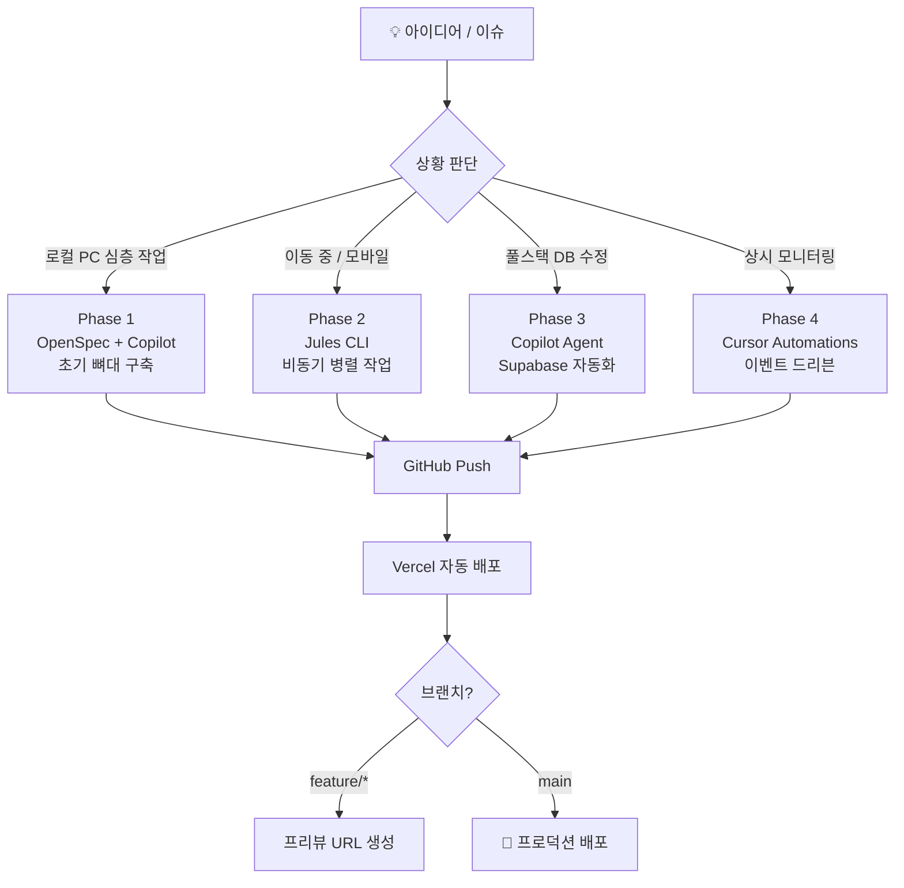
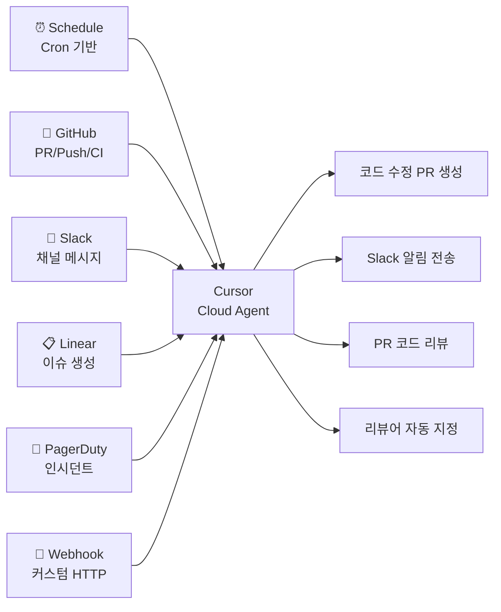

# 프론트엔드 개발자의 한계를 부수는 AI 에이전트 주도 풀스택 워크플로우

> **"타자 속도가 아니라, 에이전트가 쉬지 않고 일할 수 있도록 시스템을 설계하는 오케스트레이션 능력이 1인 개발자의 경쟁력이다."**

---

## 들어가며 — 당신은 이런 상황에 있지 않나요?

회사에서는 React 컴포넌트를 만들고, 백엔드 API는 "그쪽 팀에 요청"합니다.  
DB 스키마 변경? RLS 정책 설정? "잘 모르겠는데..."라며 뒤로 물러섭니다.  
개인 프로젝트를 시작했지만, 풀스택의 벽 앞에서 번번이 멈춥니다.

이 글은 그 벽을 부수는 이야기입니다.

**독박게임(Dokbak Game)** — 지인들과 함께 즐기려고 만든 개인 웹게임 프로젝트.  
프론트엔드 개발자 혼자서 Next.js + Supabase 풀스택을 운영 중인 실제 사이드 프로젝트입니다.  
👉 **[dokbakgame.vercel.app](https://dokbakgame.vercel.app)**

이 프로젝트를 어떻게 AI 에이전트들과 함께 만들고 운영해 왔는지,  
그리고 2026년 3월 현재 어디까지 진화했는지 4단계로 나눠 공유합니다.

---

## 전체 워크플로우 개요



---

## 🏗️ Phase 1 — 로컬 뼈대 구축: OpenSpec + GitHub Copilot + Vercel CLI

> **"먼저 구조를 선언하고, AI가 그 구조를 채운다."**

### OpenSpec으로 아키텍처를 먼저 설계하다

막연하게 코드를 짜기 전에, **OpenSpec**으로 프로젝트의 요구사항과 아키텍처를 선언적으로 정의했습니다.  
`openspec/project.md`에 기술 스택, 컨벤션, 도메인 컨텍스트를 기록해두면 이후 모든 AI 에이전트가 이 문서를 참조해 일관된 코드를 생성합니다.

```bash
# OpenSpec 초기화
npx openspec init

# 변경 제안서 생성 (예: 게임 점수 저장 기능 추가)
# openspec/changes/add-game-score/ 하위에 proposal.md, tasks.md, spec 델타 생성
openspec validate add-game-score --strict
```

`openspec/project.md`의 핵심 역할:

```markdown
## Domain Context
- 독박게임: Next.js App Router + Supabase PostgreSQL 기반 웹게임
- 인증: Supabase Auth (Google OAuth)
- DB: game_scores, users, game_sessions 테이블
- 배포: Vercel (main → 프로덕션, feature/* → 프리뷰)
```

### GitHub Copilot으로 보일러플레이트를 빠르게

OpenSpec이 "무엇을 만들지"를 정의했다면, **GitHub Copilot**이 "어떻게 만들지"를 실행합니다.

```bash
# Next.js 프로젝트 초기화
npx create-next-app@latest dokbak-game \
  --typescript --tailwind --eslint --app --src-dir

# Supabase 클라이언트 설치
npm install @supabase/supabase-js @supabase/ssr
```

Copilot에게 `openspec/project.md`를 컨텍스트로 주면 프로젝트 구조에 맞는 코드를 바로 생성합니다:

```
# VS Code Copilot Chat
@workspace openspec/project.md를 참고해서
/src/lib/supabase/client.ts 와 server.ts를 생성해줘
```

### Vercel CLI로 CI/CD 파이프라인 연결

```bash
# Vercel CLI 설치 및 프로젝트 연결
npm install -g vercel
vercel link

# 로컬에서 프로덕션 환경 변수 확인
vercel env pull .env.local

# 배포 테스트 (프리뷰)
vercel deploy
```

GitHub 저장소와 Vercel을 연결하면 이후 모든 push는 자동으로 빌드됩니다:

| 브랜치 | 배포 환경 | URL |
|--------|-----------|-----|
| `main` | Production | `dokbakgame.vercel.app` |
| `feature/*` | Preview | `dokbakgame-git-feature-xxx.vercel.app` |
| `develop` | Preview | `dokbakgame-git-develop.vercel.app` |

> 💡 **Key Takeaway**  
> OpenSpec으로 아키텍처를 선언하면 이후 투입되는 모든 AI 에이전트가 프로젝트 컨텍스트를 공유한다.  
> "AI가 내 프로젝트를 이해하게 만드는 것"이 가장 중요한 첫 번째 단계다.

---

## 📱 Phase 2 — 공간의 제약 해소: Google Jules와 모바일 병렬 개발

> **"퇴근 후 버스 안에서도 PR이 쌓인다."**

### Jules란 무엇인가

**Jules**는 Google이 만든 클라우드 기반 비동기 AI 코딩 에이전트입니다.  
당신이 잠을 자는 동안, 이동하는 동안, 회의하는 동안에도 Jules는 GitHub 저장소에서 코드를 분석하고 수정하며 PR을 올립니다.

```
[당신의 지시 — 자연어]
        ↓
[Jules: 클라우드 VM에서 저장소 클론]
        ↓
[코드 분석 → 계획 수립 → 코드 작성]
        ↓
[테스트 실행 → Critic Agent 자체 검토]
        ↓
[GitHub PR 생성 → 알림 수신]
        ↓
[당신: 모바일로 리뷰 → Merge]
```

### Jules 모델 진화 타임라인

Jules의 성능은 Gemini 모델 업그레이드와 함께 급격히 향상되었습니다:

| 시기 | 모델 | 주요 변화 |
|------|------|-----------|
| 2025년 8월 (베타 출시) | Gemini 2.5 Pro | Thinking 기반 계획 수립, 초기 Critic Agent |
| 2025년 11월 | **Gemini 3 Pro** | Ultra 사용자 우선 출시, 멀티모달 시각 검증 강화 |
| 2026년 1월 30일 | **Gemini 3 Flash** | 전체 사용자 적용, 이전 대비 속도·정확도 대폭 향상 |

> Gemini 3 Flash는 공식 발표에서 _"이전 기본 모델(Gemini 2.5 Pro)보다 빠르고 훨씬 더 유능하다"_ 고 설명합니다.  
> 독박게임처럼 Next.js 라우팅 + Supabase 스키마가 얽힌 코드베이스 전체를 Jules가 한 번에 파악할 수 있는 이유입니다.

### Jules Continuous AI — 단순 어시스턴트를 넘어

Jules는 2025년 12월부터 **"Continuous AI"** 패러다임을 도입했습니다:

| 기능 | 설명 | 사용 예시 |
|------|------|-----------|
| **Scheduled Tasks** | Cron 기반 정기 작업 | 매주 월요일 의존성 취약점 검사 |
| **Suggested Tasks** | `// TODO` 코드를 감지해 자동 제안 | 미완성 기능 목록을 PR로 변환 |
| **CI Fixer** | Jules가 올린 PR의 CI 실패를 자동 수정 | 빌드 에러를 스스로 고치고 재제출 |
| **MCP 연동** | Supabase, Linear, Neon 등 외부 도구 | DB 스키마 변경을 Jules가 직접 실행 |

특히 **Supabase MCP 연동**은 독박게임 프로젝트에서 큰 변화를 만들었습니다 — Jules가 프론트엔드 코드 수정과 DB 마이그레이션을 한 번에 처리할 수 있게 되었습니다.

### Jules CLI — 터미널에서 Jules 제어하기

Jules는 브라우저/모바일뿐만 아니라 CLI로도 제어할 수 있습니다:

```bash
# 설치
npm install -g @google/jules

# 구글 계정 인증
jules login

# 연결된 저장소 목록 확인
jules remote list --repo

# 새 작업 위임 (현재 디렉토리에서 저장소 자동 감지)
jules remote new --session "랭킹 페이지에 태그 필터 기능 추가. \
  /app/ranking/page.tsx 참고해서 Tailwind + TypeScript 사용"

# 진행 중인 세션 목록 확인
jules remote list --session

# 완료된 세션 결과(코드 변경) 로컬에 가져오기
jules remote pull --session <session_id>

# 병렬 작업 — 같은 태스크를 5개 버전으로 동시 시도
jules remote new --session "점수 계산 로직 최적화" --parallel 3
```

**TUI 대시보드** — GUI 없이 터미널에서 diff 확인:

```bash
# 인터랙티브 대시보드 실행
jules
```

### 실제 모바일 작업 시나리오

```
[출근길 지하철]
스마트폰 → jules.google.com 접속
↓
저장소 'dokbak-game' 선택
↓
"랭킹 페이지 1~10위 배경색을 금/은/동메달 컬러로 변경하고,
 11위 이하는 현재 스타일 유지. /app/ranking/page.tsx 수정"
↓
[Jules가 클라우드에서 작업 시작 — 나는 회의 진행]
↓
[점심시간] 푸시 알림: "PR #47 생성됨"
↓
모바일 GitHub 앱에서 diff 확인 → Merge
↓
Vercel 자동 배포 완료 🚀
```

> 💡 **Key Takeaway**  
> Jules는 "명령을 기다리는 어시스턴트"가 아니라 "위임받은 작업을 끝까지 책임지는 팀원"이다.  
> 이동 중에도 작업을 위임하고, 완료 알림을 받아 리뷰하는 **비동기 개발 루프**가 생산성을 수배로 높인다.

---

## 🔧 Phase 3 — 로컬 풀스택 시연: Copilot Agent가 Supabase까지 건드린다

> **"프론트엔드 개발자가 DB 마이그레이션을 두려워하지 않게 되는 순간."**

### 시연: "게임 결과 저장" 기능 한 번에 추가하기

VS Code에서 GitHub Copilot Agent를 열고 단 한 번의 지시를 입력합니다:

```
@workspace openspec/project.md와 openspec/changes/add-game-score/proposal.md를 
참고해서 게임 결과 저장 기능을 구현해줘.
필요한 것:
1. 프론트엔드 컴포넌트 (src/components/GameResult.tsx)
2. Supabase game_scores 테이블 생성 SQL 마이그레이션 파일
3. RLS 정책 (인증된 사용자만 자신의 점수 입력 가능)
4. API Route (/app/api/scores/route.ts)
```

Copilot Agent가 생성하는 결과물:

**① 프론트엔드 컴포넌트** — `src/components/GameResult.tsx`

```typescript
'use client'

import { createClient } from '@/lib/supabase/client'
import { useState } from 'react'

interface GameResultProps {
  score: number
  gameName: string
}

export default function GameResult({ score, gameName }: GameResultProps) {
  const [saving, setSaving] = useState(false)
  const supabase = createClient()

  const saveScore = async () => {
    setSaving(true)
    const { data: { user } } = await supabase.auth.getUser()
    if (!user) return

    const { error } = await supabase
      .from('game_scores')
      .insert({ user_id: user.id, game_name: gameName, score })

    if (!error) alert('점수가 저장되었습니다!')
    setSaving(false)
  }

  return (
    <div className="flex flex-col items-center gap-4 p-6 bg-white rounded-2xl shadow">
      <h2 className="text-2xl font-bold">게임 종료!</h2>
      <p className="text-4xl font-black text-indigo-600">{score.toLocaleString()}점</p>
      <button
        onClick={saveScore}
        disabled={saving}
        className="px-6 py-2 bg-indigo-500 text-white rounded-lg hover:bg-indigo-600 disabled:opacity-50"
      >
        {saving ? '저장 중...' : '점수 저장하기'}
      </button>
    </div>
  )
}
```

**② Supabase 마이그레이션 파일** — `supabase/migrations/20260309_create_game_scores.sql`

```sql
-- game_scores 테이블 생성
CREATE TABLE IF NOT EXISTS public.game_scores (
  id          UUID DEFAULT gen_random_uuid() PRIMARY KEY,
  user_id     UUID REFERENCES auth.users(id) ON DELETE CASCADE NOT NULL,
  game_name   TEXT NOT NULL,
  score       INTEGER NOT NULL DEFAULT 0,
  created_at  TIMESTAMPTZ DEFAULT NOW() NOT NULL
);

-- 인덱스: 랭킹 조회 성능 최적화
CREATE INDEX idx_game_scores_game_name_score
  ON public.game_scores (game_name, score DESC);

-- RLS 활성화
ALTER TABLE public.game_scores ENABLE ROW LEVEL SECURITY;

-- 정책 1: 인증된 사용자만 자신의 점수 삽입 가능
CREATE POLICY "Enable insert for authenticated users only"
  ON public.game_scores
  FOR INSERT
  WITH CHECK (auth.uid() = user_id);

-- 정책 2: 모든 사용자가 랭킹 조회 가능 (읽기는 공개)
CREATE POLICY "Enable read access for all users"
  ON public.game_scores
  FOR SELECT
  USING (true);

-- 정책 3: 본인 점수만 삭제 가능
CREATE POLICY "Enable delete for own scores"
  ON public.game_scores
  FOR DELETE
  USING (auth.uid() = user_id);
```

**③ API Route** — `app/api/scores/route.ts`

```typescript
import { createClient } from '@/lib/supabase/server'
import { NextResponse } from 'next/server'

export async function POST(request: Request) {
  const supabase = await createClient()
  const { data: { user }, error: authError } = await supabase.auth.getUser()

  if (authError || !user) {
    return NextResponse.json({ error: 'Unauthorized' }, { status: 401 })
  }

  const { score, gameName } = await request.json()

  const { data, error } = await supabase
    .from('game_scores')
    .insert({ user_id: user.id, game_name: gameName, score })
    .select()
    .single()

  if (error) {
    return NextResponse.json({ error: error.message }, { status: 500 })
  }

  return NextResponse.json(data, { status: 201 })
}

export async function GET(request: Request) {
  const supabase = await createClient()
  const { searchParams } = new URL(request.url)
  const gameName = searchParams.get('game') ?? 'all'

  const query = supabase
    .from('game_scores')
    .select('score, created_at, users(nickname)')
    .order('score', { ascending: false })
    .limit(100)

  if (gameName !== 'all') {
    query.eq('game_name', gameName)
  }

  const { data, error } = await query
  if (error) return NextResponse.json({ error: error.message }, { status: 500 })
  return NextResponse.json(data)
}
```

### Supabase CLI로 마이그레이션 적용

```bash
# 로컬 Supabase 환경에 마이그레이션 적용
npx supabase db push

# 또는 프로덕션에 직접 적용
npx supabase db push --linked
```

### 이게 왜 혁명적인가

예전 같으면 이 작업은 최소 3명이 필요했습니다:
- 백엔드 개발자 → 테이블 설계 + RLS 정책 작성
- DBA → 인덱스 최적화
- 프론트엔드 개발자 → 컴포넌트 + API 호출

Copilot Agent는 `project.md`의 컨텍스트를 읽고 **단 한 번의 지시로 세 역할을 동시에 수행**했습니다.

> 💡 **Key Takeaway**  
> OpenSpec의 `project.md`가 AI 에이전트의 "사전 교육"이다.  
> 컨텍스트가 잘 정리된 프로젝트일수록 AI가 더 정확하게, 더 넓은 범위를 자동화한다.  
> 프론트엔드 개발자가 DB를 두려워하지 않게 만드는 것은 "공부"가 아니라 "좋은 컨텍스트 설계"다.

---

## ⚡ Phase 4 — 넥스트 레벨: Cursor Automations와 주도형 AI (2026년 3월 출시)

> **"반응하는 AI에서, 먼저 움직이는 AI로."**

### Jules와 Cursor Automations의 결정적 차이

| 구분 | Jules | Cursor Automations |
|------|-------|-------------------|
| **작동 방식** | 명령형 — 내가 지시해야 시작 | 이벤트 드리븐 — 트리거 발생 시 자동 실행 |
| **실행 환경** | Google Cloud VM | Cursor Cloud Sandbox |
| **항상 켜져 있나?** | ❌ 세션 단위 | ✅ 상시 가동 |
| **적합한 작업** | 기능 추가, 리팩토링 | 코드 리뷰, 모니터링, 버그 수정 |
| **트리거** | 수동 프롬프트 | GitHub, Slack, Schedule, Webhook 등 |
| **메모리** | 저장소 단위 메모리 | 실행 간 Memories 유지 |

### Cursor Automations 트리거 종류



### 독박게임에 Cursor Automations 적용 시나리오

**시나리오 1: Vercel 빌드 에러 자동 수정**

Vercel Webhook과 Cursor Automations를 연결하면:

```
[Vercel 빌드 실패]
        ↓
[Webhook → Cursor Automations 트리거]
        ↓
[Cloud Agent: 에러 로그 분석 + 코드베이스 검색]
        ↓
[핫픽스 코드 작성 → PR 생성]
        ↓
[Slack 알림: "빌드 에러 수정 PR #53 생성됨"]
        ↓
[개발자: 모바일로 리뷰 → Merge → 재배포 성공 ✅]
```

**시나리오 2: PR 자동 보안 리뷰**

```
[GitHub: feature/* 브랜치 PR 오픈]
        ↓
[Cursor Automations: "Pull request opened" 트리거]
        ↓
[Agent: diff 분석 → 보안 취약점, RLS 누락, SQL Injection 검사]
        ↓
[PR 인라인 코멘트: "game_scores 테이블에 RLS 정책이 누락되었습니다"]
        ↓
[개발자: 코멘트 확인 → 수정 후 Merge]
```

**시나리오 3: 매일 새벽 자동 테스트 커버리지**

```
[Schedule: 매일 오전 3시 Cron 트리거]
        ↓
[Agent: 어제 머지된 코드 분석 → 테스트 없는 함수 탐지]
        ↓
[테스트 코드 자동 작성 → PR 생성]
        ↓
[아침에 일어나면 테스트 PR이 기다리고 있음 ☕]
```

### `.cursor/automations` 설정 예시

```yaml
# .cursor/automations/vercel-error-fixer.yml
name: Vercel Build Error Fixer
trigger:
  type: webhook
  # Vercel Dashboard → Settings → Webhooks에서 등록
prompt: |
  Vercel 빌드 에러가 발생했습니다.
  에러 로그를 분석하고 원인을 파악한 뒤,
  최소한의 변경으로 수정하는 핫픽스 PR을 생성해주세요.
  수정 후 Slack #deploy 채널에 요약을 전송해주세요.
tools:
  - pull_request
  - comment_on_pull_request
  - send_to_slack
  - mcp: supabase
```

> ⚠️ **비용 주의**: Cursor Automations는 Cloud Agent 사용량 기반으로 과금됩니다.  
> 트리거 빈도와 작업 복잡도에 따라 비용이 달라지므로 `cursor.com/docs/models-and-pricing` 에서 확인 후 설정하세요.

> 💡 **Key Takeaway**  
> Jules가 "내가 시킨 일을 잘하는 팀원"이라면,  
> Cursor Automations는 "알아서 문제를 발견하고 처리하는 시니어 팀원"이다.  
> 두 도구의 조합이 진정한 1인 풀스택 팀의 완성형이다.

---

## 🎯 마무리 — 에이전트 오케스트레이션 시대의 1인 개발

### 전체 도구 매트릭스

| 상황 | 도구 | 나의 역할 |
|------|------|-----------|
| 로컬 초기 설계 | OpenSpec | 아키텍처 설계자 |
| 로컬 코드 작성 | GitHub Copilot Agent | 리뷰어 |
| 이동 중 / 모바일 | Jules CLI / Web | 작업 위임자 |
| 풀스택 DB 변경 | Copilot Agent + Supabase | 검토자 |
| 상시 자동화 | Cursor Automations | 시스템 설계자 |
| CI/CD 배포 | Vercel | 없음 (완전 자동) |

### 독박게임이 증명한 것

- 혼자서 Next.js + Supabase 풀스택을 **실제 운영** 중
- Jules CLI로 이동 중 기능 추가 → **Merge까지 모바일로 완결**
- Copilot Agent 한 번으로 **프론트엔드 + DB 마이그레이션 + RLS 동시 생성**
- 2026년 3월 기준, Cursor Automations로 **"자동화된 팀원"** 합류 준비 중

### 1인 개발자의 새로운 정의

```
과거: 코드를 직접 타이핑하는 사람
현재: AI 에이전트에게 올바른 지시를 내리는 사람
미래: 에이전트들이 24시간 돌아가는 시스템을 설계하는 사람
```

> **"미래의 1인 개발은 타자 속도가 아니라,**  
> **에이전트가 쉬지 않고 일할 수 있도록**  
> **시스템(Trigger & PR 파이프라인)을 설계하는**  
> **오케스트레이션 능력에 달려 있다."**

---

## 📎 참고 링크

| 도구 | 링크 |
|------|------|
| 독박게임 (데모) | https://dokbakgame.vercel.app |
| OpenSpec | https://github.com/openspec |
| Jules 공식 문서 | https://jules.google/docs |
| Jules CLI 레퍼런스 | https://jules.google/docs/cli/reference |
| Jules Changelog | https://jules.google/docs/changelog |
| Jules Continuous AI 가이드 | https://jules.google/docs/guides/continuous-ai-overview |
| Cursor Automations | https://cursor.com/docs/cloud-agent/automations |
| Cursor Automations 블로그 | https://cursor.com/blog/automations |
| Vercel 배포 가이드 | https://vercel.com/docs |
| Supabase RLS 문서 | https://supabase.com/docs/guides/database/postgres/row-level-security |

---

*작성일: 2026년 3월 9일*  
*발표자: 프론트엔드 개발자 → AI 에이전트 오케스트레이터*
